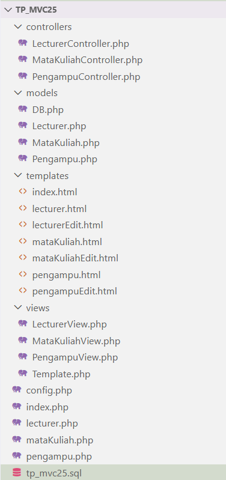

# TP8DPBO2425C2
Saya Fauzia Rahma Nisa mengerjakan Tugas Praktikum 8 dalam mata kuliah Desain dan Pemrograman Berdasarkan Objek untuk keberkahanNya maka saya tidak melakukan kecurangan seperti yang telah dispesifikasikan. Aamiin.

**1. Desain Program**

   Program ini dibangun menggunakan pola MVC (Model–View–Controller) yang mengelola tiga entitas utama: Lecturer, Mata Kuliah, dan Pengampu.
   
   lecturer:
   - id INT
   - nama VARCHAR(100)
   - nidn VARCHAR(20)
   - telepon VARCHAR(20)
   - tanggal_gabung DATE

   mata_kuliah:
   - id INT
   - nama_matkul VARCHAR(100)
   - kode_matkul VARCHAR(20)
   - sks INT
     
   pengampu:
   - id INT
   - id_dosen INT
   - id_matkul INT
   - semester VARCHAR(10)
   - tahun_ajaranVARCHAR(20)
     
   Relasi :
   - 1 dosen → banyak pengampu
   - 1 mata kuliah → banyak pengampu
   - Pengampu mengikat relasi many-to-many antara dosen dan mata kuliah.

   Struktur Folder tp_mvc2025
   
   
   
- Folder controllers/ : Berisi file yang menangani logika program. Controller menerima input dari user (tambah, edit, hapus), memanggil model, dan mengirim hasilnya ke view.
  
- Folder models/ : Tempat menyimpan file yang berhubungan dengan database. Model melakukan query: SELECT, INSERT, UPDATE, DELETE.
  
- Folder views/ : Berisi file yang menghubungkan controller dengan template HTML. View menyiapkan data yang dikirim controller, lalu memasukkannya ke template.
  
- Folder templates/ : Berisi file HTML murni yang menjadi tampilan akhir ke user. View akan mengisi bagian dinamis di file ini.
  
- Filde Utama di Root Folder : lecturer.php, mataKuliah.php, pengampu.php (menjadi pintu masuk/router), config.php (konfigurasi database), index.php (halaman awal yang ngeredirect ke pengampu.php), tp_mvc25_2.sql (file database)

  **2. Alur Program**
  
  Alur program ini berjalan dari user sampai data tampil kembali di browser. Saat user membuka halaman atau menekan tombol (tambah, edit, hapus), file utama seperti lecturer.php akan mengecek aksi apa yang diminta. Aksi ini kemudian diteruskan ke controller yang bertugas mengatur jalannya proses. Controller akan meminta atau mengirim data ke model, yaitu bagian yang berisi query ke database. Model berhubungan langsung dengan tabel di database untuk mengambil, menambah, mengubah, atau menghapus data. Setelah model selesai memproses data, controller mengirim hasilnya ke view untuk diubah menjadi tampilan HTML. View lalu memakai template untuk mengganti placeholder seperti judul, tabel, atau nilai input menjadi tampilan yang lengkap. Terakhir, halaman yang sudah jadi ditampilkan ke browser sehingga user bisa melihat hasil perubahan atau data terbaru.

  https://youtu.be/TlyO7Ybqgoo
